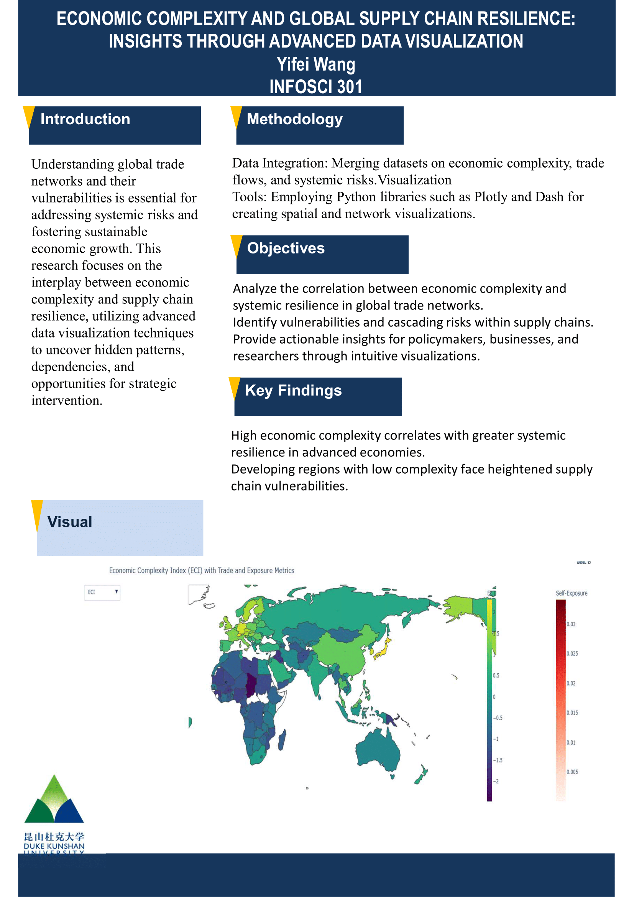

# Economic Complexity and Global Supply Chain Resilience: Insights through Advanced Data Visualization

## Project Overview
This project explores the interplay between economic complexity and global supply chain resilience using advanced data visualization techniques. The objective is to uncover patterns and vulnerabilities in trade networks and provide actionable insights for policymakers, researchers, and businesses.

---

## Authors
- **Name**: Yifei Wang
- **Role**: Project Lead and Developer
---

## Disclaimer
This repository contains the final project for **INFOSCI 301 Data Visualization and Information Aesthetics**, instructed by **Prof. Luyao Zhang** at **Duke Kunshan University in Autumn 2024**.

---

## Acknowledgments
- Prof. Luyao Zhang for invaluable guidance and feedback.
- INFOSCI 301 Classmates for collaborative discussions and feedback insights.
- AIGC tools like ChatGPT for drafting and revising project documentation.
- Thanks to Chakraborty et al. for providing data on exposure,  the UN Comtrade Database for providing Trade data, and ECI data

---
## Embedded Media
### Demo Video
[Download Demo Video](emo%20Video_INFOSCI%20301_Yifei%20Wang.mp4)

### Poster

